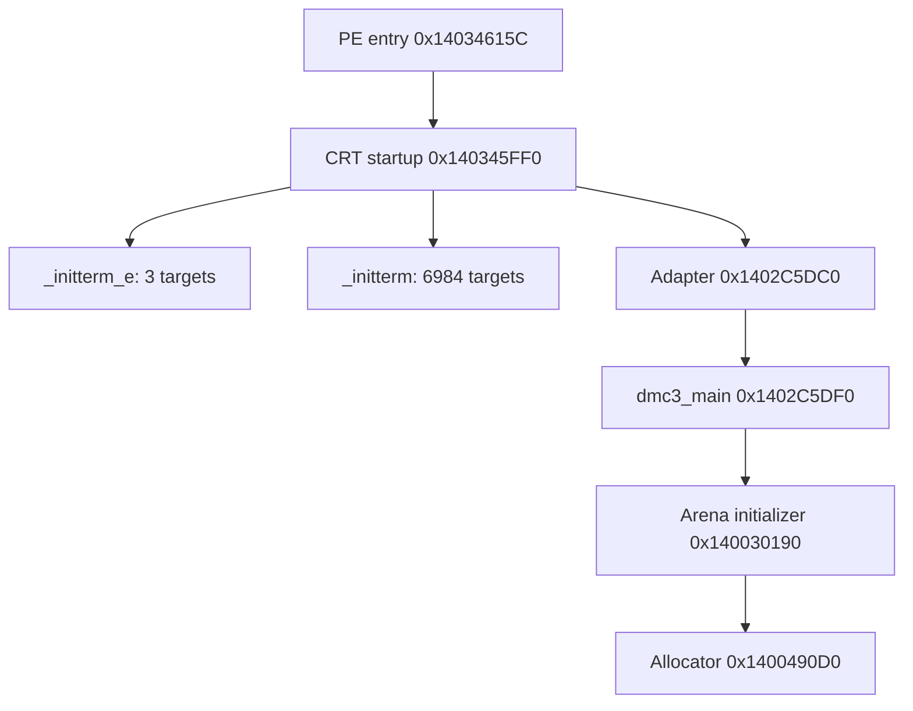

# DMC3 — основна структура EXE та звірка з Google Drive

Дата: 2026-09-15. Гілка: **Ада-Астра**.
Canonical SHA-256: `e454272ed0fb0247fcbcf300e5d55d7a3e96d50b89b9ffaff81bb978dcbdd082`.

## Висновок

**Поточне уточнення:** [адресна перевірка пропусків](dmc3-tree-completeness-audit-2026-09-15.md) виявила 7450 коренів, пропущених у попередньому CFG. [Відновлений root-pass](dmc3-root-expansion-2026-09-15.md) включив їх; [наступний CRT/lifecycle прохід](dmc3-crt-lifecycle-2026-09-15.md) дослідив 83 складні входи та фізичні межі трьох довгих pointer-runs. Дерево залишається OPEN / NOT EXHAUSTIVE; 20 доменів не є доказом вичерпної структури.

[CPtxManager](dmc3-ptx-manager-state-2026-09-15.md) уже має C++-реалізацію
операцій кешу, перевірену проти EXE. [Наступний прохід](dmc3-ptx-payload-state-2026-09-15.md)
відновив завантажувачі bundle та очищення пулу; parser, materializer і render
finalizer залишаються явними зовнішніми межами. [Черга гілки](ada-astra-reverse-queue.md)
фіксує наступні ділянки й відкриті структурні прогалини.

Загальна карта охоплює запуск і глобальну
ініціалізацію; менеджери та фабрики сцен; модель об'єктів; ресурси; виконання
ігрової логіки; платформні служби. Це не відновлені оригінальні каталоги
Capcom і не завершена декомпіляція. Наслідування, виклики, володіння об'єктами
та посилання на ресурси — різні типи зв'язків.

Матеріали Drive використані як історична карта. Твердження з них не отримують
статус EXE_CONFIRMED автоматично. У цьому проході повторно перевірено PE,
межі CRT-таблиць, вісім переходів запуску, константу арени, прив'язку CMcAppli,
TLS-метадані та наявний C++-екстрактор RTTI. Решта підсистем зберігає явно
позначену історичну або часткову доказовість.

## 1. Фізична структура

| Секція | Роль у карті | Межа висновку |
|---|---|---|
| `.text` | машинний код, також вбудовані таблиці | не кожен байт — інструкція |
| `.rdata` | константи, метадані, таблиці адрес | читання адреси не доводить її семантику |
| `.data` | змінний глобальний стан | 8 516 024 байти virtual size, 548 864 байти raw size |
| `.pdata` | 12 235 записів розкручування стека | це не 12 235 незалежних C++-функцій |
| `.gfids` | службова секція образу | семантика кожного запису тут не перевірялася |
| `.tls` | шаблон thread-local state | callback-масив у PE починається нулем |
| `.rsrc` | PE-ресурси | окремо від зовнішніх ігрових архівів |
| `.reloc` | переміщення адрес при завантаженні | не карта ігрових залежностей |

У `.data` є **7 967 160 байтів virtual tail**, не представлених raw-байтами
секції у файлі. Це пояснює частину великого глобального стану; розміри окремих
об'єктів не можна виводити лише з відстані між відомими глобальними адресами.

## 2. Запуск

Граф показує підтверджені виклики, а не всі умовні гілки. Entry спочатку
викликає `0x14034673C`, потім переходить у CRT startup. CRT викликає адаптер
у `0x140346102`. Адаптер читає `__p___argv` і `__p___argc` та робить tail-jump
у `dmc3_main` на `0x1402C5DDF`.

Підтверджені межі CRT:

| Таблиця | Початок | Кінець, не включно | Слоти | Ненульові унікальні адреси |
|---|---|---|---:|---:|
| `_initterm` | `0x14034F808` | `0x14035D250` | 6985 | **6984** |
| `_initterm_e` | `0x14035D258` | `0x14035D278` | 4 | **3** |

Обидві таблиці містять по одному нульовому слоту. У Drive зустрічається
число 6983 для `.CRT$XCU`; воно не описує повний діапазон `_initterm`, який
передає цей EXE. Без відновленого критерію виключення одного запису його не
слід використовувати як загальну кількість. 6984 ініціалізатори також не
означають 6984 класи: серед них є копіювання констант та прості записи стану.

TLS directory: `0x14050CEE8`, шаблон `[0x140D98000, 0x140D98008)`, індекс
`0x140D71C08`, масив callbacks `0x14035D288` порожній на диску. Це не виключає
окремих callback-шляхів CRT або динамічної реєстрації.

## 3. Пам'ять та глобальні об'єкти

`0x140030194` передає **0x10400000 = 260 MiB** до `0x1400490D0`.
Алокатор використовує імпорт `VirtualAlloc` через `0x14034F0C8`.
Повернений base записується в `0x1405D9EA8`, base+size — у `0x1405D9EF0`.
Повний розподіл усіх внутрішніх областей потребує окремого проходу.

Ініціалізатор `0x140023E10` передає довжину `0x340` та адресу
`0x140CF3310` до helper, потім записує туди vtable `0x140508728`.
RTTI пов'язує цю vtable з `CMcAppli`. Історичні save-дослідження описують
його як application/save compatibility object; це не доказ, що він володіє
всіма підсистемами гри.

## 4. Модель об'єктів і сцени

Повторний запуск наявного C++-екстрактора дав:

- 408 кандидатів decorated type names, **407 hierarchy-linked types**;
- 915 COL та 915 vtable anchors;
- **438 прямих зв'язків наслідування** замість історичних 433;
- 12 235 unwind ranges, з них 4846 chained і 2210 handler-bearing.

Це структурні спостереження. Межі vtable, повні сигнатури методів і всі
розміри об'єктів не відновлені автоматично. Попередній звіт
`dmc3-internal-runtime-tree-2026-09-13.md` містить п'ять доданих ребер.

Підтверджені RTTI-зв'язки: `CSceneFactoryApp → ISceneFactory`,
`CSceneMgrRoot → CSceneMgr`, `CSceneMgrGame → CSceneMgr`,
`CFactoryEnemy → IFactoryEnemy`, `CPtxManager → IPtxManager`.
Це наслідування, не схема володіння.

Фабрика сцен `0x140240090` має десять слотів таблиці `0x1402402B8`.
Порядок імен за історичною картою Drive: Boot, Opening, StartMenu,
MisSelect, Game, GameMain, Demo, MisStart, Result, Ending. Сирі case-адреси
повторно отримані C++-екстрактором; повні переходи між сценами та життєвий
цикл кожної сцени тут не підтверджені заново.

## 5. Повна карта основних доменів

Імена 00–19 — навігаційна організація дослідження. «Історична» означає:
Drive містить відповідне напрацювання, але повний код домену в цьому проході
не перевірявся. Наявність класу чи імпорту не доводить завершення підсистеми.

| Домен | Відомі опорні вузли | Стан цього проходу |
|---|---|---|
| 00 Engine Foundation | CWork, CActor, контейнери, lifetime | RTTI повторно; поведінка часткова |
| 01 Application Platform | CRT, dmc3_main, arena, globals | запуск і CRT повторно перевірені |
| 02 Resource Runtime | PAC/NBZ/AFS, dispatch, AsyncIOThread | історична карта та наявний код репо |
| 03 Scene Runtime | CSceneMgr, CSceneFactoryApp | RTTI і таблиця сцен повторно |
| 04 Rendering | D3D11/DXGI, CPtxManager, gfxTexture | RTTI CPtxManager; решта історична |
| 05 Audio | FMOD, sound registry `0x1405DE5B0` | імпорти перевірені попереднім проходом; ownership відкритий |
| 06 Input | XInput, DirectInput, Steam compatibility | історична карта |
| 07 Camera | CSpline, camera matrix helpers | історична карта адрес |
| 08 Animation Constraints | CMotion, CClip, constraints, IK | історична карта і окремі форматні дослідження |
| 09 Gameplay | command/action/damage contracts | RTTI; повна поведінка відкрита |
| 10 Enemy Runtime | CFactoryEnemy, CNonPlayer | RTTI; 46-selector dispatch історичний |
| 11 Player Runtime | CPlayer, weapons, projectiles | RTTI; поведінка відкрита |
| 12 Stage Runtime | StageSet, stage resource table | історична карта та окремі resource-докази |
| 13 Item Runtime | CItem → CWork, ItemKey/ItemOrb | повторна RTTI-основа |
| 14 Effect Runtime | particle family, generators | повторна RTTI-основа; dispatch частковий |
| 15 UI HUD | CUID*, message/font resources | історична карта та RTTI |
| 16 Save Progression | CMcAppli, legacy package, Steam bridge | глобальний initializer повторно; serializer історичний |
| 17 Demo Cutscene | CSceneDemo, clips, video manager | історична карта та RTTI |
| 18 Steam Platform | Steam context, achievements, RemoteStorage | імпортна межа; внутрішнє володіння відкрите |
| 19 Debug Crash Policy | exception/crash/CRT paths | PE/unwind основа; політика часткова |

## 6. Відкриті питання для наступного структурного проходу

1. Прив'язати call-bearing CRT initializers до кожного глобального об'єкта,
   його конструктора, destructor registration та користувачів.
2. Побудувати ownership-граф менеджерів: хто створює, зберігає, оновлює і
   знищує scene/resource/render/audio/input objects.
3. Відновити порядок tick/update/draw та shutdown. Спільний викликаючий
   метод не є достатнім доказом володіння.
4. Доповнити indirect dispatch за конкретним типом receiver, а не вгадувати
   vtable за формою `call [register+offset]`.

Для раніше невідомої комірки `0x14034F7F8` тепер зафіксовано on-disk pointer
`0x14024EA30`. Її роль і можливе переписування завантажувачем залишаються
відкритими; це не оголошується новим менеджером гри.

## Відтворення та джерела

`python scripts/reverse/extract_exe_structure.py dmc3.exe /tmp/exe-structure`
відтворює `structure.json` та адресний список CRT. Вісім прямих переходів,
чотири аргументи меж таблиць, адресні прив'язки globals і константи мають
перевірки за байтами. Повторний self-test наявного C++ runtime-tree tool — PASS;
повторний canonical census — PASS. Жодного запуску самої гри не виконано.

Прочитані джерела та revision IDs збережено в `drive-sources.json`:

- [Master Architecture](https://docs.google.com/document/d/10ctsZbqXQvJtJPaGaJ9dG5c294AX1p7r9q9x7yUSTdw)
- [Address Map](https://docs.google.com/document/d/1KdmzRsvQVAefpmi54zqaDRtz5SfaHTPuwdFjs3Sih-0)
- [Global Reverse Book](https://docs.google.com/document/d/1PiD6TWLx0pzeBo-uO-LIMSV97tn4fQ3rhXu7OeXdHPQ)

Оригінальні документи Drive не змінені. Цей звіт узгоджує їх із поточним
EXE, зберігаючи історичну доказовість і явно зазначені прогалини.
